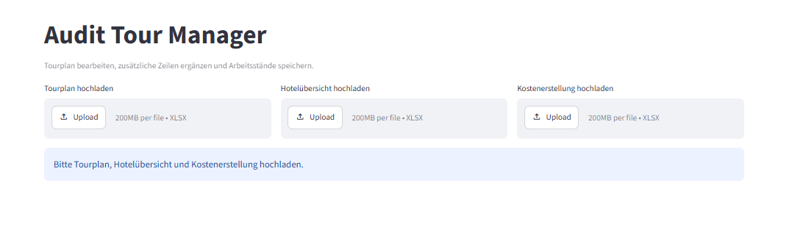
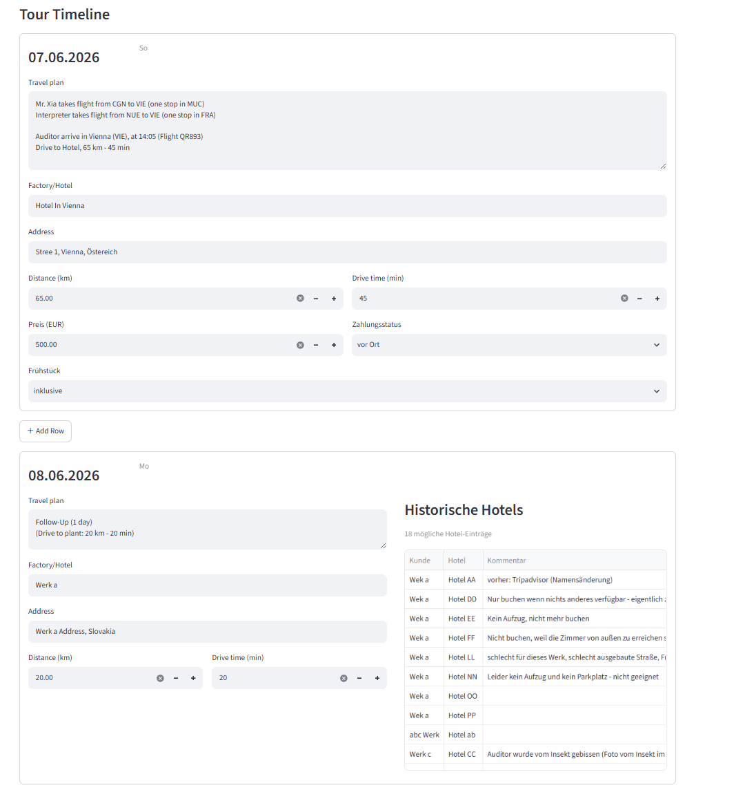
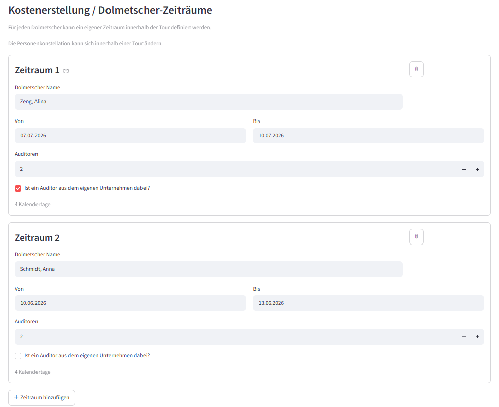
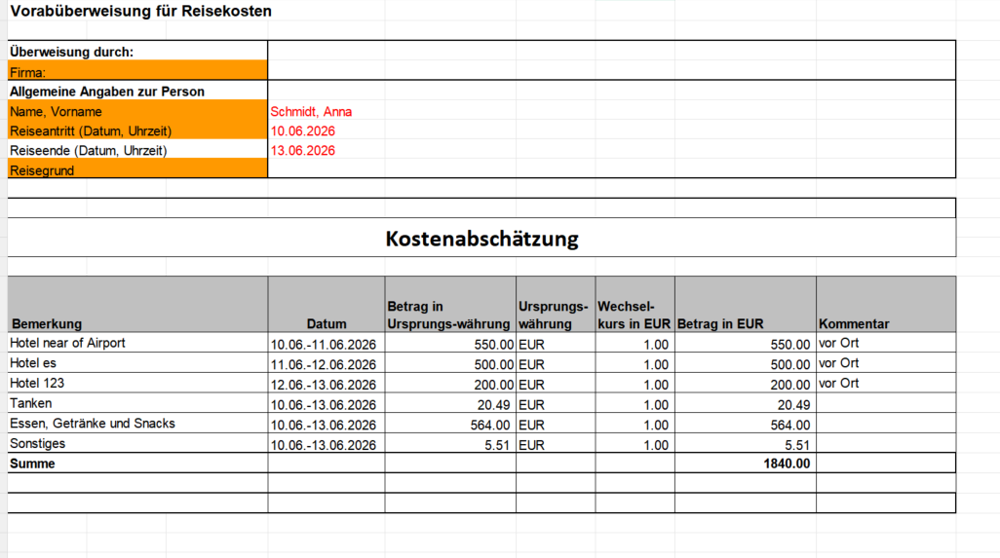

# Audit Tour Manager

A business process automation tool for planning multi-day audit tours and generating travel cost reports.

The application transforms a previously Excel-based manual workflow into a structured process for tour planning, hotel management, interpreter assignment, travel distance tracking and automated cost reporting.

> **Demo Version:** All company names, persons, addresses, hotel information and costs used in this repository are fictionalized for demonstration purposes.

## Business Problem

Audit tour planning required information to be maintained manually across multiple Excel files. Tour schedules, historical hotel information, interpreter assignments, travel distances and cost calculations had to be checked and updated separately.

This created repetitive manual work and increased the risk of inconsistent information and calculation errors.

## Solution

Audit Tour Manager combines these activities into one Streamlit-based workflow.

The application allows users to:

- Upload and process existing Excel tour plans
- Match factories with previously used hotels
- Add and edit hotel information directly in the planning workflow
- Manage multiple interpreter assignment periods
- Record travel distances and hotel payment information
- Automatically calculate fuel and meal costs based on business rules
- Generate updated Tourplan Excel files
- Generate standardized Kostenerstellung Excel reports

## Business Value

The project demonstrates how an existing operational Excel workflow can be analyzed, structured and partially automated.

The solution reduces repetitive data entry, centralizes information from multiple Excel sources and applies predefined business rules consistently when generating operational reports.

## Key Features

### Tour Planning
- Upload an existing Excel Tourplan
- Read and display tour locations automatically
- Edit factories, hotels and travel information
- Add additional tour rows
- Record driving distance and travel time
- Export the updated Tourplan back to Excel

### Hotel Management
- Upload an existing hotel database
- Match factories with previously used hotels
- Use fuzzy name matching to handle different company-name formats
- Display historical hotel information and comments
- Record hotel prices, payment status and breakfast information

### Interpreter & Audit Period Management
- Create multiple interpreter periods
- Assign different interpreters to different date ranges
- Define the number of auditors for each period
- Handle additional company auditor participation
- Generate a separate cost report for each interpreter

### Automated Cost Calculation
The application automatically calculates:

- Hotel costs
- On-site hotel payments
- Driving distance
- Fuel costs
- Meal allowances
- Other costs / rounding
- Required travel budget

Fuel costs are calculated based on total driving distance, fuel consumption and fuel price.

Meal costs are calculated according to the number of travel days and participating persons.

The final budget can automatically be rounded using the "Sonstiges" position.

### Excel Automation
The application generates formatted Excel cost reports automatically.

The exported reports include:

- Interpreter name
- Travel period
- Hotel stays
- Hotel costs
- Fuel costs
- Meal costs
- Other costs
- Final total

Calculation formulas remain visible inside the generated Excel file for transparency.

### Save & Restore
Tour progress can be saved locally and restored when continuing work on the same tour.

## Workflow

1. Upload Tourplan
2. Upload hotel database
3. Edit and complete tour information
4. Review historical hotel recommendations
5. Enter distances and hotel costs
6. Define interpreter and auditor periods
7. Save the current work status
8. Export the updated Tourplan
9. Upload the cost-report template
10. Generate individual cost reports for each interpreter

## Tech Stack

- Python
- Streamlit
- pandas
- openpyxl
- RapidFuzz
- Excel
- Git / GitHub

## Project Structure

```text
audit-tour-manager/
│
├── app.py
├── services/
│   ├── cost_service.py
│   ├── excel_service.py
│   ├── hotel_service.py
│   ├── kostenerstellung_service.py
│   └── tourplan_service.py
│
├── utils/
├── sample_data/
├── screenshots/
├── requirements.txt
└── README.md
```

## Screenshots

### Application Overview


### Tour Planning


### Interpreter Period Management


### Automated Cost Report


## Installation

Clone the repository and create a virtual environment:

```bash
python -m venv .venv
```

Activate the virtual environment and install the required packages:

```bash
pip install -r requirements.txt
```

Start the application:

```bash
streamlit run app.py
```

## Demo Data

The files in `sample_data/` contain fictionalized example data and can be used to test the application workflow.

No confidential company or customer information is included in the public demo version.